

# RS26x Actility Codec

[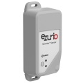](https://www.ezurio.com/iot-devices/lorawan-iot-devices/rs26x-sensor)

This is the release page for the Ezurio [RS26x][RS26x product brief] product family Codec for Actility. 

# Contents

Repository Releases include the following files.

| File Name               | Description                                                         |
|-------------------------|---------------------------------------------------------------------|
| Actility.js             | Downlink Encoder and Uplink Decoder with commented JavaScript code. |
| Actility_Uncommented.js | Downlink Encoder and Uplink Decoder with comments removed.          |

Uncommented files are intended for integration within Actility. Commented versions are provided for developer reference. A character count limitation enforced by Actility results in file size needing to be minimized, with comments being included in the character count.

Codecs are referred to as Drivers in the Actility ecosystem.

# Integration

Driver integration is performed on a per [Device][Actility Add Driver] basis. The Driver must first be added to the
Actility instance's Drivers section.

To add the Driver, the Drivers option should be selected from the tree view to the left as shown below.

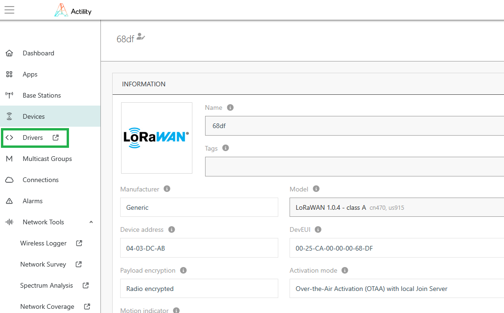

Available Drivers are displayed as shown below.

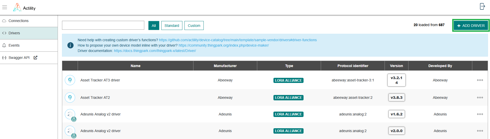

To add a Driver, the 'Add Driver' button should be clicked. This opens the Add Driver page as shown below.

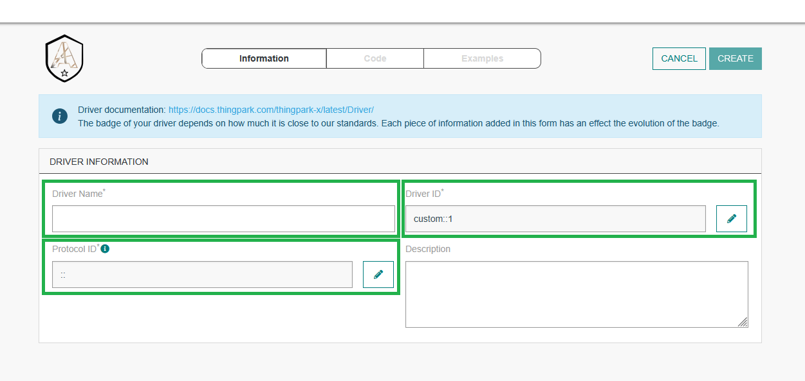

Any fields suffixed with an asterisk must be filled in prior to adding the Driver code. Failure to do so will result in a validation error occurring.

For the RS26x, 'Driver Name' is set to 'RS26x'. The 'Driver ID' field is auto-filled upon setting the Driver Name.

The Protocol Details dialog is opened by clicking the Pen icon in the 'Protocol ID' field. The Protocol Details dialog then appears as shown below.

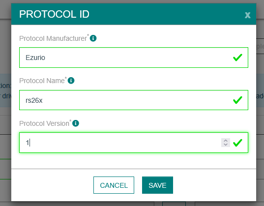

The fields should be set as shown above. Note that setting a 'Protocol Version' of 0 will result in a validation error. This must be set to 1 or greater.

The Code tab can then be navigated to by clicking the 'Code' button in the center of the page. This appears as shown below.

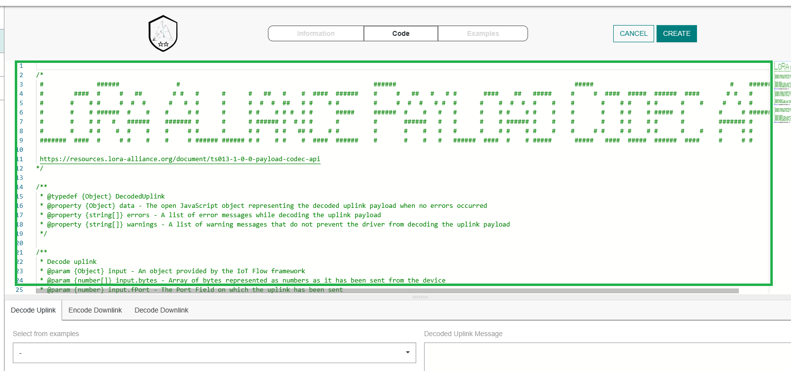

The highlighted area initially contains the default Driver implementation and consists of stubs only showing the Driver interface.

Code from the Actility Uncommented Javascript file should be copied and pasted into the highlighted area, and the initial content removed, as shown below. Following addition of the Driver code, the highlighted 'Create' button should be clicked to save the changes.

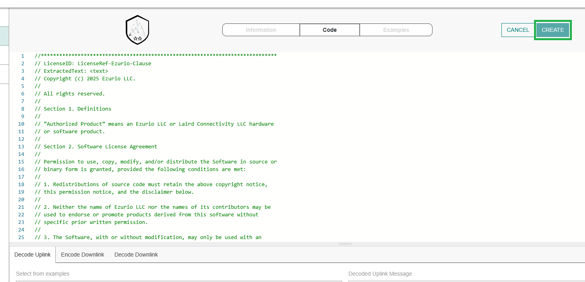

When changes are made to the Driver content, a confirmation dialog appears as shown below.

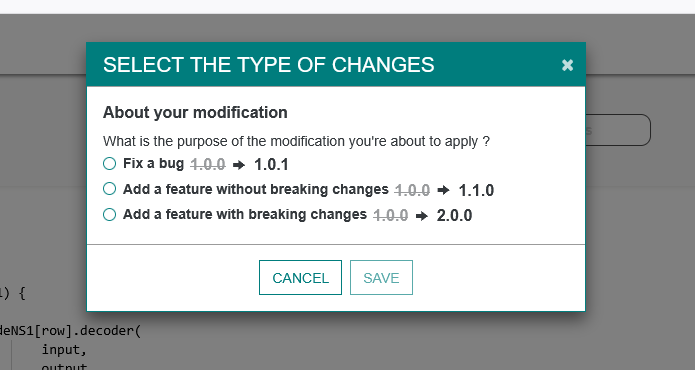

The nature of the change should be indicated then the 'Save' button clicked. Note this is typically a bug fix or feature addition.

A confirmation dialog then appears as shown below. 'Confirm' should be clicked to save the changes.

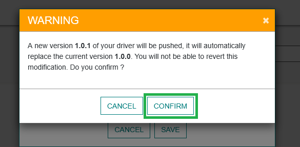

A test feature is built into the Driver page as shown below.

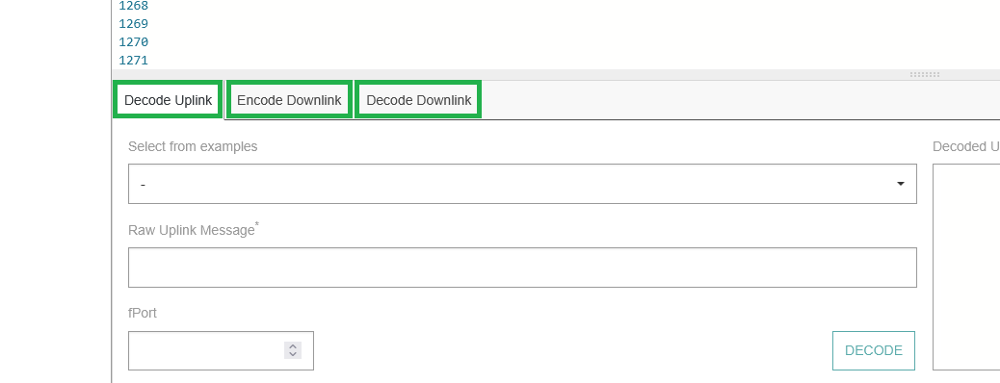

Uplink Decoding, Downlink Encoding and Downlink Decoding can be tested here. The [RS26x Protocol Specification][RS26x LoRa Protocol] should be referred to for details of protocol and parameters available for access. Examples for decoded and encoded messages are also available for review for the [RS26x Internal Temperature device][RS26x Internal Temperature Test Cases] and [RS26x External Thermistor device][RS26x External Thermistor Test Cases].

With Driver support added to the Actility installation, it can now be added to Devices.

From the main Actility page, the 'Devices' page should be navigated to, as shown below.

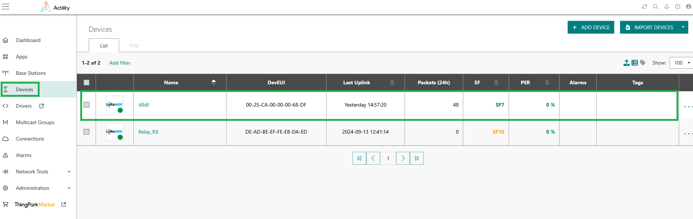

The Device where Driver support is required should be clicked. This opens the Device page as shown below.

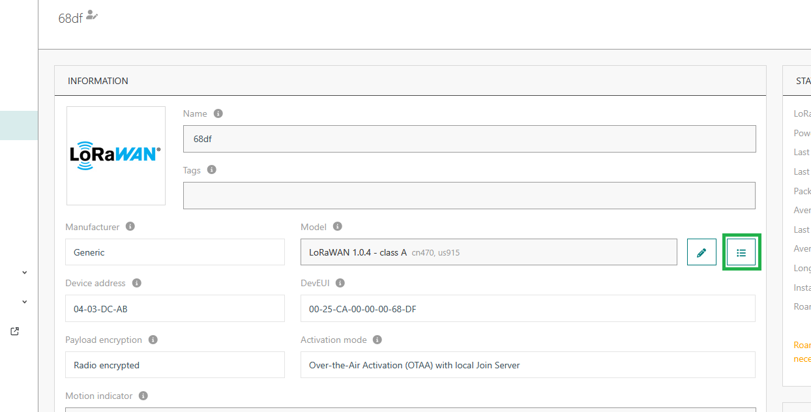

The highlighted metadata button should be clicked. This opens the Device metadata dialog as shown below.

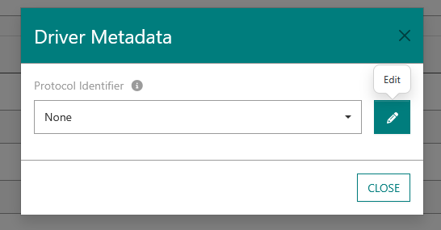

The Pen icon should be clicked to edit the Protocol, and 'Ezurio:RS26x' selected from the dropdown list, as shown below.

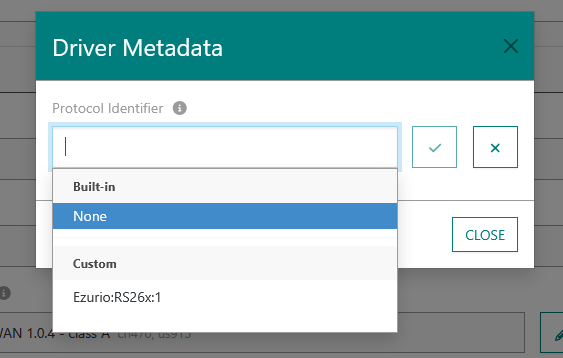

Once selected, the Confirm button (Tick mark) should be clicked as shown below.

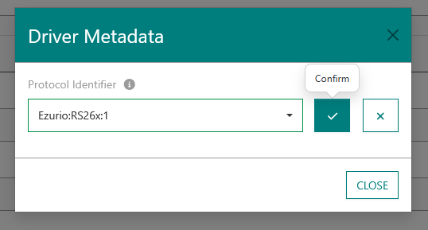

# Viewing decoded uplink data

Following integration of the Driver, uplink messages received from the device are decoded automatically.

From the Device page, decoded uplinks can be inspected by clicking the uplink of interest, as shown below.

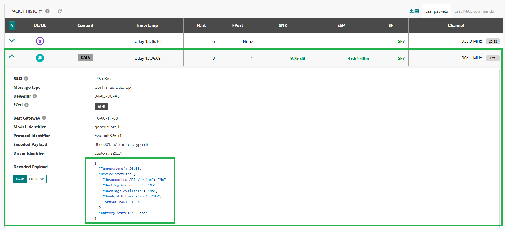

[RS26x product brief]: <https://www.ezurio.com/documentation/product-brief-rs26x-sensor>
[RS26x LoRa Protocol]: <https://www.ezurio.com/documentation/application-note-lora-protocol-rs26x-series>
[Actility Add Driver]: <https://docs.thingpark.com/thingpark-x/latest/Driver/driver-introduction>
[RS26x Internal Temperature Test Cases]: <https://github.com/TheThingsNetwork/lorawan-devices/blob/master/vendor/ezurio/rs26x-int-temp-sensor-codec.yaml>
[RS26x External Thermistor Test Cases]: <https://github.com/TheThingsNetwork/lorawan-devices/blob/master/vendor/ezurio/rs26x-ext-therm-temp-sensor-codec.yaml>
